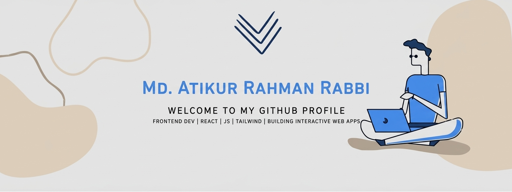

<h1 align="center">
  
</h1>

🚀 About Me 

I am a passionate Full Stack Developer from Bangladesh.
I enjoy building modern, responsive, and scalable web applications using React, Next.js, Node.js, and MongoDB.
I love learning new technologies and solving real-world problems through code.

## 🌐 My ProtFolio Live Demo

🔗 https://atikur-rahman-protfolio.vercel.app

## 💻 Skills

### Frontend

### Backend

### Tools

### 🔭 Current Activities
- Developing a Student Management Platform
- Building Full Stack MERN Applications
- Server-side Rendering & App Router in Next.js
- Practicing Data Structures & Problem Solving

<h3 align="left">Connect with me:</h3>

<h2 align="center">🔥 Languages & Frameworks & Tools 🔥</h2>

  <code></code>
  <code></code>
  <code></code>
  <code></code>
  <code></code>
  <code></code>
  <code></code>
  <code></code>
  <code></code>
  <code></code>

<h3 align="left">Support:</h3>

  

